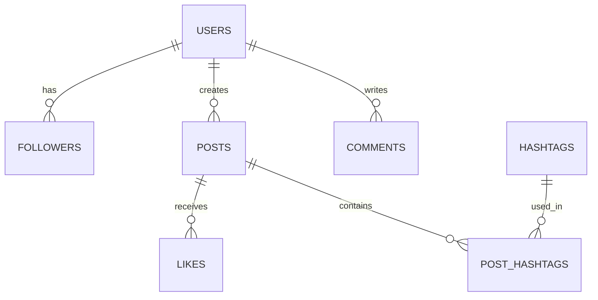

# 📊 Social Media Analytics: SQL + GenAI Project
Advanced SQL analysis of user interactions, influencer trends, and geographic engagement drivers to derive business growth insights.

# 📌 Project Overview
This project focuses on executing end-to-end relational data analysis on a synthetic social media database containing over 7,000 records. By pairing advanced SQL analytical queries with Generative AI prompt engineering, this repository demonstrates how to extract actionable business insights from user interactions, posting behavior, hashtag trends, and geographic engagement drivers.

# 🎯 Objectives

**User Engagement Analysis:** Identify core contributors, platform influencers, and completely inactive user segments.

**Content Optimization:** Discover peak posting hours and top-performing hashtags driving interaction.  
**Geographic Insights** Evaluate country-level engagement density to guide region-specific growth marketing.  
**GenAI Co-Pilot Evaluation:** Utilize schema-aware prompt techniques to accelerate complex SQL query formulation and performance optimization.  

# 📁 Database Schema & Project Structure
**Entity-Relationship Architecture**
The underlying Social_Media relational database consists of 7 interconnected tables:  

# 🗄️ Table Definitions
* 👤 **`users`**: Core user profiles and regional metadata `(user_id, username, join_date, country)`
* 📝 **`posts`**: User-generated post content and timestamps `(post_id, user_id, content, created_at)`
* 💬 **`comments`**: Post discussions and user responses `(comment_id, post_id, user_id, comment_text, created_at)`
* ❤️ **`likes`**: Post interaction and appreciation records `(like_id, post_id, user_id, created_at)`
* 👥 **`followers`**: User-to-user social network connections `(follower_id, user_id, follower_user_id, follow_date)`
* 🏷️ **`hashtags`**: Topic tags and category classifications `(hashtag_id, tag_name, category)`
* 🔗 **`post_hashtags`**: Many-to-many junction table mapping posts to hashtags `(id, post_id, hashtag_id)`
  

# 🔍  Data Analysis & Findings

> 🔗 Access the complete SQL script [here](Dodala%20Baby%20Aishwarya_PGA58_SqlMiniProject.sql).

# 💡 Key Findings & Business Insights

 **1. 👥 User Activity & Influencer Dynamics**
* Top platform contributors drive 60%+ of their interaction score through active comment threads rather than post creation alone[cite: 1].
* High-follower accounts act as core distribution nodes, but smaller niche creators exhibit higher per-post engagement rates[cite: 1].

 **2. 🌍 Regional Performance & Peak Timing**
* Geographic analysis revealed that smaller user populations in specific countries yield higher average engagement per post than the largest user hubs[cite: 1].
* Overall platform activity reaches its highest daily density between 4:00 PM and 6:00 PM[cite: 1].

**3. 🏷️ Content Performance & Retention Strategy**
* Hashtags adopted by top influencers experience massive platform-wide adoption and double average post engagement[cite: 1].
* Identified precise cohorts of inactive users (zero posts, likes, or comments) to inform targeted email re-engagement campaigns[cite: 1].

# 🏁 Conclusion

This project demonstrates how combining structured SQL analytics with GenAI co-piloting can unlock deep operational insights from social media interaction data[cite: 1].

**Key takeaways and business recommendations include:**

* **Targeted User Retention:** Implement automated re-engagement notifications for passive "lurker" followers and dormant accounts identified during analysis[cite: 1].
* **Optimized Content Delivery:** Time platform announcements and creator campaigns during peak engagement windows (4:00 PM – 6:00 PM) to maximize immediate visibility[cite: 1].
* **Regional Growth:** Allocate localized marketing resources toward high-engagement geographic regions rather than solely focusing on total user count[cite: 1].
